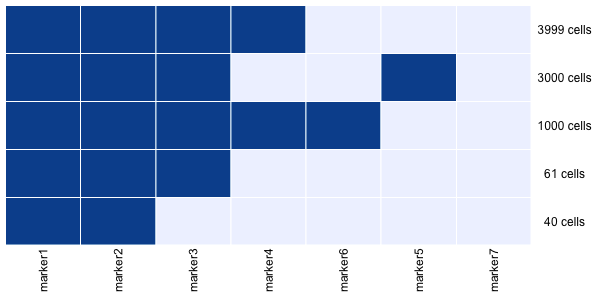
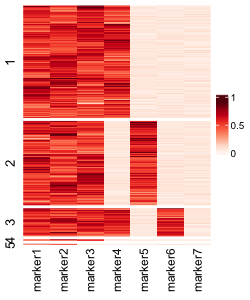

### Rarity: Discovering rare cell populations from single-cell imaging data

This repository implements Rarity, a hybrid clustering framework with the goal to identify potentially novel rare clusters of cells. 


### Getting started

The core of rarity is a binary latent variable model which is fitted in PyTorch. We post-process the results in R, so you would need access to both a python as well as an R installation. Below is a demonstration how to use Rarity on synthetic IMC data. 

First, we load the necessary libraries, including `reticulate` which lets us perform python calls from R. 

```
library(tidyverse)
library(reticulate)
use_python("/usr/local/bin/python3")

source("R/core.R")
source("R/helpers.R")
```

Here we load the synthetic dataset which was created in [examples/generate_synthetic_data.R](examples/generate_synthetic_data.R)

```
# read in the synthetic data
df <- read_csv("data/synthetic1.csv")
Y <- as.matrix(df)
```

This is similar to the example shown in Figure 1


where we have 5 cell types. 

Next we fit Rarity

```
m <- Rarity_fit(Y, n_iter = 20000L, batch_size = 512)
```

We can now visualise the inferred binary signatures 

```
plot_binary_signatures(m, n_cells = 30)
```


and we can also plot the heatmap of the observed marker intensities, splitting the rows according to the inferred Rarity clusters
```
plot_heatmap_with_observations(Y, m, n_cells = 30)
```

