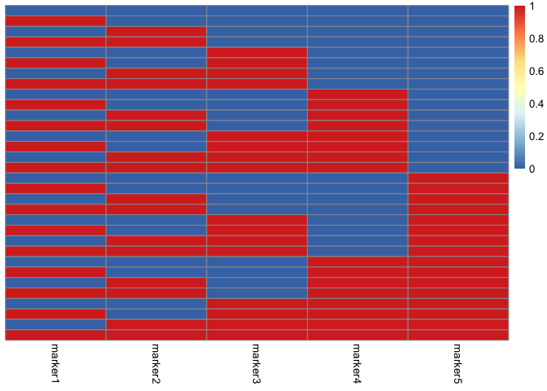
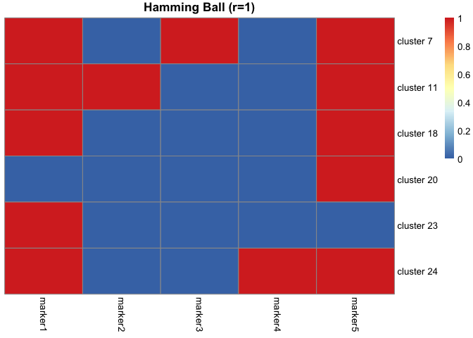
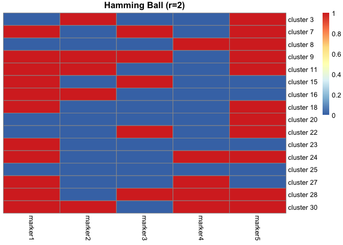

Hamming Ball query example
================

In this notebook, we show how to perform a Hamming Ball query on a
synthetic dataset.

### Setup

Setting up data generation etc code

``` r
library(tidyverse)
```

Recitulate package is needed for calling python (requires a python
installation with numpy and torch)

``` r
library(reticulate)
use_condaenv("/Users/kmartens/Library/r-miniconda-arm64")
```

Other imports

``` r
# rarity
source("R/core.R")
# baseline clustering methods
source("R/baselines.R")
# helper functions for plotting
source("R/helpers.R")
```

Code for synthetic data generation

``` r
rmatnorm <- function(mean_mat, sd_mat){
  eps <- rnorm(nrow(mean_mat) * ncol(mean_mat), mean=mean_mat, sd=sd_mat)
  matrix(eps, nrow(mean_mat), ncol(mean_mat))
}

generate_synthetic_data <- function(marker_mat, n_cells, noise_sd1 = 0.03, noise_sd2 = 0.18){
  Y <- do.call("rbind", lapply(1:nrow(marker_mat), function(i){
    binary_exprs <- t(replicate(n_cells[i], marker_mat[i, ]))
    epsilon <- rnorm(ncol(binary_exprs) * nrow(binary_exprs))
    mean <- 0.05 + 0.5 * binary_exprs
    sd <- noise_sd1 * (binary_exprs == 0) + noise_sd2 * (binary_exprs == 1)
    exprs <- rmatnorm(mean, sd)
    exprs[exprs < 0] <- 0
    exprs[exprs > 1] <- 0.99
    exprs
  }))
  colnames(Y) <- paste0("marker", 1:ncol(Y))
  Y
}
```

Underlying binary marker signatures

``` r
# generate all combinations of binary ON/OFF states
marker_mat <- as.matrix(expand.grid(replicate(5, 0:1, simplify = FALSE)))

# visualise these binary signatures
colnames(marker_mat) <- paste0("marker", 1:ncol(marker_mat))
pheatmap::pheatmap(marker_mat, cluster_cols=FALSE, cluster_rows=FALSE)
```

<!-- -->

Data

``` r
n_ground_truth_clusters <- nrow(marker_mat)
n_cells <- rpois(n_ground_truth_clusters, lambda = 50)
Y <- generate_synthetic_data(marker_mat, n_cells)
```

Run Rarity clustering on this data

``` r
rarity_fit <- Rarity_fit(Y, batch_size = 1024L, n_iter=12000L)
```

    ## iter     0 loss 11407.63
    ## iter  1000 loss -2535.81
    ## iter  2000 loss -6484.76
    ## iter  3000 loss -6537.52
    ## iter  4000 loss -6574.82
    ## iter  5000 loss -6414.92
    ## iter  6000 loss -6447.10
    ## iter  7000 loss -6471.71
    ## iter  8000 loss -6383.99
    ## iter  9000 loss -6291.20
    ## iter 10000 loss -6193.88
    ## iter 11000 loss -6207.85

### Hamming Ball query

Suppose we’re interested in finding cells whose expression signatures
are “close” to our signature of interest. In this example, in the
signature of interest, only the first and the last marker are ON (the
rest are OFF). This will be the query signature:

``` r
query_signature <- c(
  "marker 1" = 1, 
  "marker 2" = 0, 
  "marker 3" = 0,
  "marker 4" = 0,
  "marker 5" = 1
)
```

Function `hamming_ball_query` helps us search for all those cells whose
binary signature deviate from a reference cell type by no more than a
given number of markers (i.e. their Hamming distance from the reference
signature does not exceed a given radius). Let’s try out the query with
`radius = 1` and `radius = 2`.

``` r
source("R/hamming_ball_query.R")

cluster_idx <- hamming_ball_query(query_signature, rarity_fit, radius = 1)
```

Let’s visualise those binary signatures from this Hamming Ball (radius
= 1) query

``` r
pheatmap::pheatmap(rarity_fit$unique_profiles[cluster_idx, ], cluster_cols=FALSE, cluster_rows=FALSE, main="Hamming Ball (r=1)")
```

<!-- -->

as well as from a Hamming Ball (radius = 2) query

``` r
cluster_idx <- hamming_ball_query(query_signature, rarity_fit, radius = 2)
pheatmap::pheatmap(rarity_fit$unique_profiles[cluster_idx, ], cluster_cols=FALSE, cluster_rows=FALSE, main="Hamming Ball (r=2)")
```

<!-- -->
