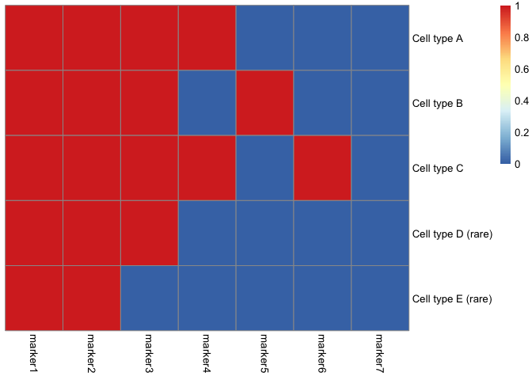

Synthetic data generation with downsampling (as in Figure 4)
================

### Setup

Setting up data generation etc code

``` r
library(tidyverse)
library(uwot)
library(assertthat)
```

Recitulate package is needed for calling python (requires a python
installation with numpy and torch)

``` r
library(reticulate)
use_condaenv("/Users/kmartens/Library/r-miniconda-arm64")
```

Other imports

``` r
# rarity
source("R/core.R")
# baseline clustering methods
source("R/baselines.R")
# helper functions for plotting
source("R/helpers.R")
```

Helper functions for metrics

``` r
# metrics
source("R/utils.R")

calculate_metrics <- function(cl, true_cl){
  bind_rows(
    data.frame(
      helper_metrics_conditional(table(cl, true_cl), selected_cell_type = 4), 
      cell_type = 4
    ),
    data.frame(
      helper_metrics_conditional(table(cl, true_cl), selected_cell_type = 5),
      cell_type = 5
    )
  )
}
```

Code for synthetic data generation

``` r
rmatnorm <- function(mean_mat, sd_mat){
  eps <- rnorm(nrow(mean_mat) * ncol(mean_mat), mean=mean_mat, sd=sd_mat)
  matrix(eps, nrow(mean_mat), ncol(mean_mat))
}

generate_synthetic_data <- function(marker_mat, n_cells, noise_sd1 = 0.03, noise_sd2 = 0.18){
  assertthat::assert_that(nrow(marker_mat) == length(n_cells))
  
  Y <- do.call("rbind", lapply(1:nrow(marker_mat), function(i){
    binary_exprs <- t(replicate(n_cells[i], marker_mat[i, ]))
    epsilon <- rnorm(ncol(binary_exprs) * nrow(binary_exprs))
    mean <- 0.05 + 0.5 * binary_exprs
    sd <- noise_sd1 * (binary_exprs == 0) + noise_sd2 * (binary_exprs == 1)
    exprs <- rmatnorm(mean, sd)
    exprs[exprs < 0] <- 0
    exprs[exprs > 1] <- 0.99
    exprs
  }))
  colnames(Y) <- paste0("marker", 1:ncol(Y))
  Y
}
```

Underlying binary marker signatures

``` r
marker_mat <- rbind(
  c(1, 1, 1, 1, 0, 0, 0),
  c(1, 1, 1, 0, 1, 0, 0),
  c(1, 1, 1, 1, 0, 1, 0),
  # rare 1
  c(1, 1, 1, 0, 0, 0, 0),
  # rare 2
  c(1, 1, 0, 0, 0, 0, 0)
)

# visualise these binary signatures
colnames(marker_mat) <- paste0("marker", 1:ncol(marker_mat))
rownames(marker_mat) <- paste("Cell type", c("A", "B", "C", "D (rare)", "E (rare)"))
pheatmap::pheatmap(marker_mat, cluster_cols=FALSE, cluster_rows=FALSE)
```

<!-- -->

### First scenario

``` r
n_cells <- c(3000, 2000, 1000, 30, 30)

set.seed(1)
Y <- generate_synthetic_data(marker_mat, n_cells)
true_cl <- rep(1:nrow(marker_mat), n_cells)
```

UMAP

``` r
df_umap <- Seurat_UMAP(Y)
helper_plot_UMAP_rare_cells(df_umap, true_cl)
```

<!-- -->

PhenoGraph

``` r
cl_phenograph <- Phenograph_clustering(Y)
```

    ##   Finding nearest neighbors...DONE ~ 0.118 s
    ##   Compute jaccard coefficient between nearest-neighbor sets...DONE ~ 1.635 s
    ##   Build undirected graph from the weighted links...DONE ~ 0.249 s
    ##   Run louvain clustering on the graph ...DONE ~ 0.231 s
    ##   Return a community class
    ##   -Modularity value: 0.7600365 
    ##   -Number of clusters: 16

``` r
plot_UMAP_with_highlighted_clusters(cl_phenograph, true_cl, df_umap) +
  labs(title = "Phenograph")
```

<!-- -->

FlowSOM

``` r
cl_flowsom <- FlowSOM_clustering(Y, k=5)

plot_UMAP_with_highlighted_clusters(cl_flowsom, true_cl, df_umap) +
  labs(title = "FlowSOM")
```

<!-- -->

Rarity

``` r
rarity <- Rarity_fit(Y, batch_size = 1024L, n_iter=12000L, seed=1L)
```

    ## iter     0 loss 17914.88
    ## iter  1000 loss -7197.33
    ## iter  2000 loss -7274.92
    ## iter  3000 loss -7617.32
    ## iter  4000 loss -7634.45
    ## iter  5000 loss -7716.11
    ## iter  6000 loss -7746.75
    ## iter  7000 loss -7889.37
    ## iter  8000 loss -7698.05
    ## iter  9000 loss -7600.75
    ## iter 10000 loss -7492.87
    ## iter 11000 loss -7456.07

``` r
helper_plot_rarity(rarity, true_cl, df_umap) +
  labs(title = "Rarity")
```

<!-- -->

Metrics

``` r
# metrics
df_phenograph1 <- calculate_metrics(cl_phenograph, true_cl)
df_rarity1 <- calculate_metrics(rarity$cluster_allocations, true_cl)
df_flowsom1 <- calculate_metrics(cl_flowsom, true_cl)

bind_rows(
  df_phenograph1, 
  df_rarity1, 
  df_flowsom1, 
) %>% 
  mutate(method = rep(c("Phenograph", "Rarity", "FlowSOM"), each=2)) %>%
  group_by(method) %>%
  summarise(
    Completeness = mean(completeness),
    Homogeneity = mean(homogeneity), 
    V_measure = mean(v_measure)
  )
```

    ## # A tibble: 3 × 4
    ##   method     Completeness Homogeneity V_measure
    ##   <chr>             <dbl>       <dbl>     <dbl>
    ## 1 FlowSOM           0.759       0.244     0.362
    ## 2 Phenograph        0.797       0.508     0.608
    ## 3 Rarity            0.972       0.547     0.675

### Second scenario

``` r
n_cells <- c(3000, 2000, 1000, 60, 60)

set.seed(1)
Y <- generate_synthetic_data(marker_mat, n_cells)
true_cl <- rep(1:nrow(marker_mat), n_cells)
```

UMAP

``` r
df_umap <- Seurat_UMAP(Y)
helper_plot_UMAP_rare_cells(df_umap, true_cl)
```

<!-- -->

PhenoGraph

``` r
cl_phenograph <- Phenograph_clustering(Y)
```

    ##   Finding nearest neighbors...DONE ~ 0.15 s
    ##   Compute jaccard coefficient between nearest-neighbor sets...DONE ~ 1.306 s
    ##   Build undirected graph from the weighted links...DONE ~ 0.22 s
    ##   Run louvain clustering on the graph ...DONE ~ 0.285 s
    ##   Return a community class
    ##   -Modularity value: 0.7637332 
    ##   -Number of clusters: 14

``` r
plot_UMAP_with_highlighted_clusters(cl_phenograph, true_cl, df_umap) +
  labs(title = "Phenograph")
```

<!-- -->

FlowSOM

``` r
cl_flowsom <- FlowSOM_clustering(Y, k=5)

plot_UMAP_with_highlighted_clusters(cl_flowsom, true_cl, df_umap) +
  labs(title = "FlowSOM")
```

<!-- -->

Rarity

``` r
rarity <- Rarity_fit(Y, batch_size = 1024L, n_iter=12000L, seed=1L)
```

    ## iter     0 loss 17927.61
    ## iter  1000 loss -7118.69
    ## iter  2000 loss -7382.40
    ## iter  3000 loss -7659.59
    ## iter  4000 loss -7727.19
    ## iter  5000 loss -7817.30
    ## iter  6000 loss -7874.26
    ## iter  7000 loss -7905.37
    ## iter  8000 loss -7774.88
    ## iter  9000 loss -7685.82
    ## iter 10000 loss -7526.55
    ## iter 11000 loss -7457.96

``` r
helper_plot_rarity(rarity, true_cl, df_umap) +
  labs(title = "Rarity")
```

<!-- -->

Metrics

``` r
# metrics
df_phenograph2 <- calculate_metrics(cl_phenograph, true_cl)
df_rarity2 <- calculate_metrics(rarity$cluster_allocations, true_cl)
df_flowsom2 <- calculate_metrics(cl_flowsom, true_cl)

bind_rows(
  df_phenograph2, 
  df_rarity2, 
  df_flowsom2, 
) %>% 
  mutate(method = rep(c("Phenograph", "Rarity", "FlowSOM"), each=2)) %>%
  group_by(method) %>%
  summarise(
    Completeness = mean(completeness),
    Homogeneity = mean(homogeneity), 
    V_measure = mean(v_measure)
  )
```

    ## # A tibble: 3 × 4
    ##   method     Completeness Homogeneity V_measure
    ##   <chr>             <dbl>       <dbl>     <dbl>
    ## 1 FlowSOM           0.768       0.262     0.374
    ## 2 Phenograph        0.852       0.473     0.606
    ## 3 Rarity            0.955       0.620     0.730

### Third scenario

``` r
n_cells <- c(3000, 2000, 1000, 300, 300)

set.seed(1)
Y <- generate_synthetic_data(marker_mat, n_cells)
true_cl <- rep(1:nrow(marker_mat), n_cells)
```

UMAP

``` r
df_umap <- Seurat_UMAP(Y)
helper_plot_UMAP_rare_cells(df_umap, true_cl)
```

<!-- -->

PhenoGraph

``` r
cl_phenograph <- Phenograph_clustering(Y)
```

    ##   Finding nearest neighbors...DONE ~ 0.101 s
    ##   Compute jaccard coefficient between nearest-neighbor sets...DONE ~ 1.445 s
    ##   Build undirected graph from the weighted links...DONE ~ 0.235 s
    ##   Run louvain clustering on the graph ...DONE ~ 0.217 s
    ##   Return a community class
    ##   -Modularity value: 0.7880625 
    ##   -Number of clusters: 13

``` r
plot_UMAP_with_highlighted_clusters(cl_phenograph, true_cl, df_umap) +
  labs(title = "Phenograph")
```

<!-- -->

FlowSOM

``` r
cl_flowsom <- FlowSOM_clustering(Y, k=5)

plot_UMAP_with_highlighted_clusters(cl_flowsom, true_cl, df_umap) +
  labs(title = "FlowSOM")
```

<!-- -->

Rarity

``` r
rarity <- Rarity_fit(Y, batch_size = 1024L, n_iter=12000L, seed=1L)
```

    ## iter     0 loss 16579.19
    ## iter  1000 loss -7229.38
    ## iter  2000 loss -7749.60
    ## iter  3000 loss -7905.00
    ## iter  4000 loss -7956.94
    ## iter  5000 loss -8006.20
    ## iter  6000 loss -8063.29
    ## iter  7000 loss -8055.86
    ## iter  8000 loss -8005.95
    ## iter  9000 loss -7904.18
    ## iter 10000 loss -7704.51
    ## iter 11000 loss -7703.98

``` r
helper_plot_rarity(rarity, true_cl, df_umap) +
  labs(title = "Rarity")
```

<!-- -->

Metrics

``` r
# metrics
df_phenograph3 <- calculate_metrics(cl_phenograph, true_cl)
df_rarity3 <- calculate_metrics(rarity$cluster_allocations, true_cl)
df_flowsom3 <- calculate_metrics(cl_flowsom, true_cl)

bind_rows(
  df_phenograph3, 
  df_rarity3, 
  df_flowsom3, 
) %>% 
  mutate(method = rep(c("Phenograph", "Rarity", "FlowSOM"), each=2)) %>%
  group_by(method) %>%
  summarise(
    Completeness = mean(completeness),
    Homogeneity = mean(homogeneity), 
    V_measure = mean(v_measure)
  )
```

    ## # A tibble: 3 × 4
    ##   method     Completeness Homogeneity V_measure
    ##   <chr>             <dbl>       <dbl>     <dbl>
    ## 1 FlowSOM           0.885       0.448     0.590
    ## 2 Phenograph        0.956       0.607     0.737
    ## 3 Rarity            0.953       0.762     0.840
